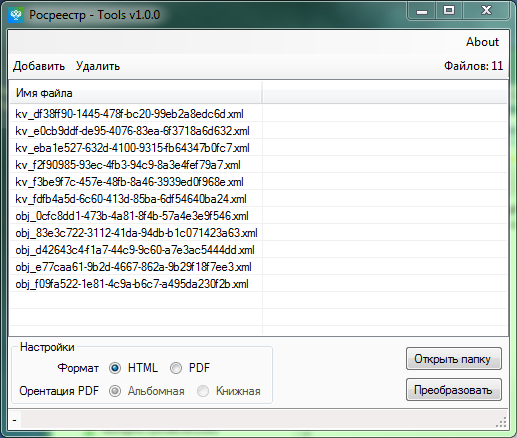

# Росреестр Tools [![Build artifact][build-src]][build-href] [![Codacy Badge][codacy-src]][codacy-href]

Приложение для конвертации XML файлов росреестра в HTML/PDF.

## Использование

1. Установить сертификат Минцифры если он не установлен.
2. Добавить файлы через меню, либо перетащить папку/файлы на список.
3. Выбрать выходной формат файлов.
4. Нажать конвертировать.
5. Открыть папку.

## Примечания

* Для конвертации файлов необходим доступ к сайту [Росреестра](https://rosreestr.gov.ru/) (Стили и схемы берутся напрямую оттуда)
* Для подключения к сайту Росреестра необходим установленный [сертификат Минцифры](https://www.gosuslugi.ru/crt)
* Для создания PDF используется Google Chrome, при его отсутствии будет скачана локальная версия Chromium(~200 МБ)

<!-- Badges -->
[build-src]: https://img.shields.io/github/actions/workflow/status/Virenbar/JANL/build-artifact.yml?label=Build&logo=github
[build-href]: https://github.com/Virenbar/JANL/actions/workflows/build-artifact.yml

[codacy-src]: https://app.codacy.com/project/badge/Grade/f375e8fc73914161a6acee13622fc535
[codacy-href]: https://app.codacy.com/gh/Virenbar/RRTools/dashboard?utm_source=gh&utm_medium=referral&utm_content=&utm_campaign=Badge_grade
