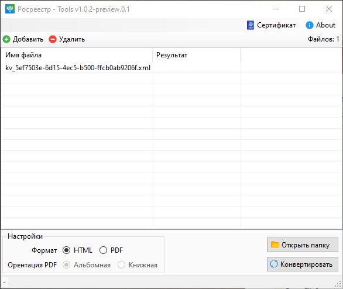

# Росреестр Tools

Приложение для конвертации XML файлов росреестра в HTML/PDF.

## Использование

1. Добавить файлы через меню, либо перетащить файлы на список.
2. Выбрать выходной формат файлов.
3. Нажать конвертировать.
4. Открыть папку.

## Примечания

* Для конвертации файлов необходим доступ к сайту [Росреестра](https://rosreestr.gov.ru/) (Стили и схемы берутся напрямую оттуда)
* Для создания PDF используется Google Chrome, при его отсутствии будет скачана локальная версия Chromium(~300 МБ)
